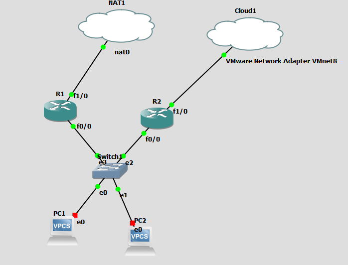

# R1
```
track 1 inter fast 1/0
int fa 0/0
ip add 10.10.10.2 255.255.255.0
no sh
standy 1 ip 10.10.10.1
standby 1 priority 150
standby 1 preempt
standby 1 track 1 decrement 70

```


# R2

```
track 1 inter fast 1/0
interface fastEthernet 0/0
no sh
ip add 10.10.10.3 255.255.255.0
standy 1 ip 10.10.10.1
standby 1 priority 100
standby 1 preempt 
standby 1 track 1 decrement 70
```


# IP-SLA
```
ip sla 1
icmp-echo 8.8.8.8 source-interface gig 0/0
frequency 5
ip sla schedule 1 life forever start-time now
track 10 ip sla 1 reachability
int fa 0/0
standby 1 track 10 decrement 30
```


 


